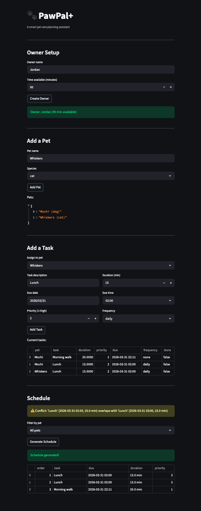
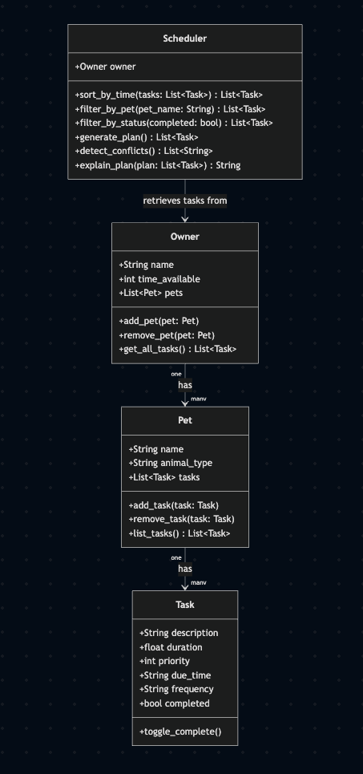

# PawPal+

A smart pet care planning assistant built with Python and Streamlit. PawPal+ helps pet owners organize daily care tasks across multiple pets with intelligent scheduling, conflict detection, and recurring task management.

## Features

- **Multi-pet management** -- Create an owner profile and add multiple pets with different species
- **Task scheduling** -- Add care tasks (walks, feeding, grooming, etc.) with duration, priority, and due time
- **Sort by time** -- Tasks are automatically sorted in chronological order using a lambda-based sort on due times
- **Filter by status** -- Completed tasks are filtered out so only pending tasks appear in the daily plan
- **Filter by pet** -- View tasks for a specific pet or all pets at once
- **Recurring tasks** -- Daily and weekly tasks auto-advance their due date when completed, staying in the schedule indefinitely
- **Conflict detection** -- Overlapping task durations are detected and surfaced as warnings (not just exact time matches)

## Demo



## Architecture



## Getting Started

### Setup

```bash
python -m venv .venv
source .venv/bin/activate  # Windows: .venv\Scripts\activate
pip install -r requirements.txt
```

### Run the app

```bash
streamlit run app.py
```

### Run the demo script

```bash
python3 main.py
```

## Testing PawPal+

Run the test suite with:

```bash
python -m pytest
```

The tests cover 8 behaviors across happy paths and edge cases:

- Toggle task completion
- Adding tasks increases pet's task count
- Sorting correctness (tasks added out of order return in chronological order)
- Recurring daily tasks (due date advances by 1 day, stays incomplete)
- Conflict detection with overlapping durations
- Generating a plan with a pet that has no tasks
- Filtering tasks by pet name
- Exact same time conflict detection

**Confidence Level: 4/5** -- core scheduling logic is well-tested, but edge cases like invalid time formats or removing pets with active tasks are not yet covered.

## Architecture

The system is built with four classes (see `UML.mermaid` for the full diagram):

- **Task** -- Dataclass representing a single care activity with description, duration, priority, due time, frequency, and completion status
- **Pet** -- Holds pet info and manages a collection of tasks
- **Owner** -- Manages multiple pets and aggregates tasks across all of them
- **Scheduler** -- The "brain" that retrieves tasks from the Owner, sorts, filters, detects conflicts, and generates a daily plan
